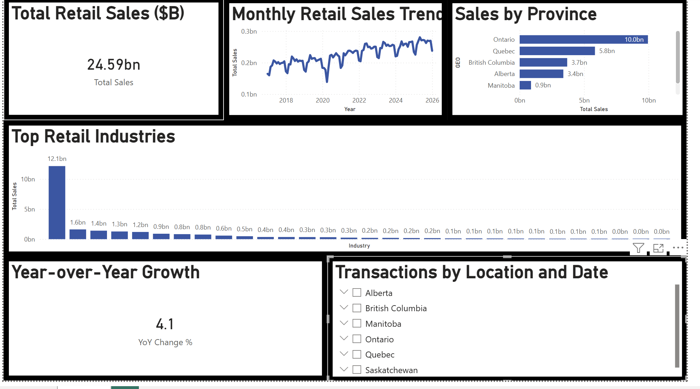

# Canadian Retail Sales Dashboard — Power BI

An interactive Power BI dashboard analysing Statistics Canada monthly retail 
trade data across 6 Canadian provinces (Ontario, Quebec, British Columbia, 
Alberta, Manitoba, Saskatchewan) from 2010 to 2024.

## Dashboard Preview

## What This Project Does

Built using real Statistics Canada open data, this dashboard tracks:
- Monthly retail sales trends by province
- Year-over-year growth rates
- Sales breakdown by retail industry sector
- Province and date range filtering via interactive slicers

## Tools Used

- Power BI Desktop — dashboard design, DAX measures, interactive slicers
- Power Query — data cleaning, null removal, data type correction
- Statistics Canada Open Data — source dataset

## Dataset

Statistics Canada Monthly Retail Trade Sales by Province (Table 20-10-0056-01)
Direct download: https://www150.statcan.gc.ca/n1/tbl/csv/20100056-eng.zip
Licence: Statistics Canada Open Licence

## DAX Measures

- **Total Sales** — SUM of all sales values based on active filters
- **YoY Change %** — year-over-year percentage change in total sales
- **Avg Monthly Sales** — average sales across all months

## Key Findings

- Ontario accounts for the largest share of Canadian retail sales
- Retail sales declined sharply in April 2020 and recovered by Q3 2020
- [Add one specific finding from your own data]

## Skills Demonstrated

Power Query · DAX Measures · KPI Cards · Interactive Slicers · 
Data Cleaning · Trend Analysis · Canadian Open Data

## Author

Eniola Bakare
linkedin.com/in/eniola-bakare-b6321125b